# Vinayak Ameta

**Systems that have to keep being right.**

Production astrology computation · chess engines · applied ML · first-principles simulation

---

## About

I build things that run unattended and have to be correct — a computation engine serving a live business, a chess engine where every change passes a statistical significance gate, a physics simulator that returned a negative result I published rather than buried.

My working rule: **a claim isn't real until it's been measured against an independent oracle.**

---

## Work

| Project | What it is | The measured part |
|---|---|---|
| **Vedic astrology engine** | Production ephemeris + chart calculation serving a live business. 64 REST endpoints, multi-language vector chart rendering. | Replaced an AGPL ephemeris and proved the swap numerically equivalent across **17,893 oracle checks**. |
| **UCI chess engine** | C++ with NNUE evaluation, ~23k LOC. | **3194 anchored Elo.** Every change SPRT-gated; negative results kept on the record. |
| **EBIL simulator** | Multi-fidelity 1D/2D/3D first-principles nanolithography simulator. | **Negative result** — single-beam infeasible; quantifies the array pathway that works. [repo →](https://github.com/ametavinayak/ebil-sim) |
| **Domain LLM** | QLoRA fine-tune of Qwen3-8B, self-built corpora, served in production. | Paired harness proved **four rounds of corpus work changed nothing measurable.** |

Also: counselling call/chat platform (Flutter + FastAPI, in production) · operations ontology and reconciliation engine · IVR monitoring with dead-air alerting.

---

## Stats

Most of my work is in private repositories — commercial engines and client systems. 
The public repo count is small on purpose; the contribution graph is the honest measure.

---

## Tech

